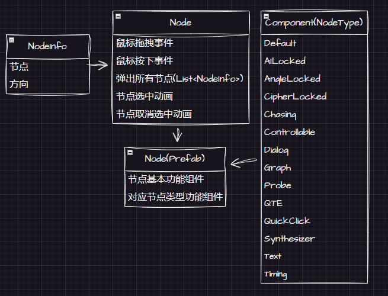
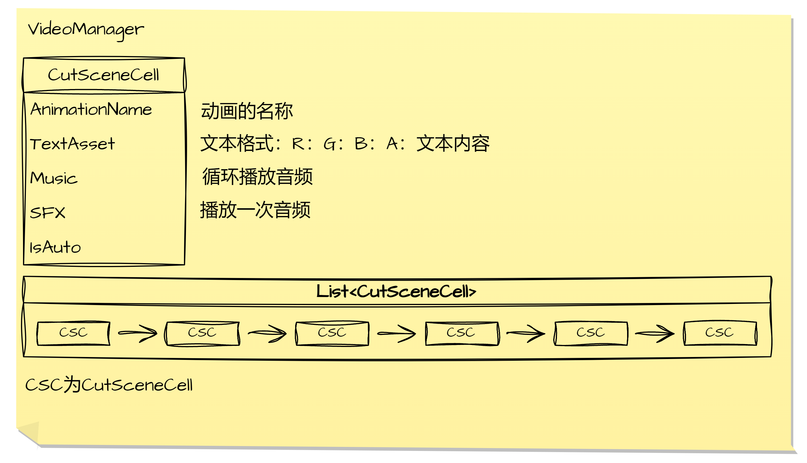

# Stay The Afterglow

## 版本

- **Unity2022.3.8f1c1**

## 节点编辑器

### 编辑需求

- 需要提供一个可供用户编辑的节点编辑界面
- 可创建节点与删除节点
- 可删除节点之间的联系
- 可通过拖拽的方式为已创建节点之间建立联系
- 创建好节点图之后可以将该节点图生成至场景当中

### 编辑器实现思路

#### 编辑部分

> 提供可编辑的节点图让用户生成节点图数据

- **NodeGraphEditor** 继承 **EditorWindow** 方便在编辑模式下对节点图进行修改，实现节点图编辑器的所有需求功能
- **NodeGraphSO** 用于存储节点图内的数据，实现对节点图内特定节点的增删改查
- **NodeTypeSO** 用于存储节点类型
- **NodeTypeListSO** 用于存储一个节点类型的列表，方便其他脚本的引用
- **NodeSO** 作为一种基类，用于存储单个节点的数据，实现单个节点的绘制与对应鼠标事件的接口

#### 生成部分

> 通过编辑部分所获得的数据来生成节点图

- **NodeMapBuilder** 实现将节点图数据转化为游戏场景中的节点图
- **NodeTemplateSO** 用于存储对应节点类型的节点预制体，方便生成对应类型的节点游戏对象

## 节点系统

### 节点功能需求

- 第一次点击节点该节点变为选中状态，第二次点击该节点会触发对应类型节点的事件
- 普通节点：弹出所有子节点
- AI锁节点：与AI进行对话，对话结束后根据焦虑值触发对应事件
- 角度锁节点：弹出对应密码数量的指针，在指针角度符合密码要求下再次点击弹出子节点
- 密码锁节点：弹出对应密码数量的锁，在锁的值与顺序符合密码要求下再次点击弹出子节点
- 追逐节点：当目标节点被弹出时，该节点被激活并去追逐目标节点，当追逐节点追逐成功则触发对应事件
- 可控制节点：指定一个目标节点，当该节点所控制的锤子与目标节点触碰，并且该锤子的速度超出阈值则目标节点弹出子节点
- 对话节点：弹出对话框进行对话，对话结束后弹出子节点
- 图节点：弹出图片框
- 文本节点：弹出文本框
- 探测节点：指定目标节点，当探测节点距离目标节点越近，节点闪烁越快，到达指定范围内激活目标节点
- 合成节点：指定目标节点，当目标节点与合成节点相交互则弹出子节点
- 时间节点：指定一个开始计时节点与终止计时节点，当开始计时节点被激活弹出，该节点被激活并开始计时，当终止节点被激活弹出，则该节点停止计时并取消激活，若时间归零，则触发对应事件
- QTE节点：配合时间节点，指定方向，向指定方向移动弹出子节点
- 快速点击节点：需要玩家多次点击，每点击四次会发生一次震动，到达指定次数后弹出子节点

### 节点功能实现思路

> 每个脚本都对应特定类型的节点的功能

- **Default** 实现简单的节点选中与弹出子节点
- **AILocked** 打开AI对话框，在对话结束后若有子节点则弹出子节点，否则跳转关卡
- **AngleLocked** 无顺序要求的匹配指针与阈值
- **CipherLocked** 按照顺序匹配密码与锁节点的值
- **Chasing** 追逐目标节点，当与目标节点相交则触发失败事件
- **Controllable** 实现操控大摆锤，以及给目标节点在被锤时弹出节点
- **Dialog** 弹出对话框，进行对话
- **Graph** 弹出图片框
- **TextShow** 弹出文本框
- **Probe** 靠近目标节点会加快闪烁，并在一定阈值内目标节点被显示
- **Synthesizer** 与目标节点相交弹出子节点
- **Timing** 在指定位置弹出并开始计时
- **QTE** 按照指定方向移动弹出子节点
- **QuickClick** 快速点击该节点，达到指定次数后弹出子节点

## 对话系统

### 对话系统需求

- 弹出对话框后开始对话
- 每句对话对应一个头像的差分
- 对话内容逐一显示
- 在显示过程中鼠标点击会直接显示该句的对话内容
- 对话结束后关闭对话框

### 对话系统实现思路

- 通过规定每次对话文本的内容规范来获取文本信息数据
- 提供一个获取文本内容的接口 **GetText(TextAsset)**
- 利用协程的技术来实现对话内容的逐一渲染
- 自定义规则来实现对应对话内容

## 图文演出

### 图文演出需求

- 一个图文演出单元包含一个动画与一串文本内容
- 非自动演出，以文本为主，在文本播放完毕之后播放下一单元演出
- 自动演出，不可跳过，以动画为主，动画播放完毕后播放下一单元演出
- 演出结束后进入节点图

### 图文演出实现思路

- 创建一个 **CutSceneCell** 来存储每个演出单元
- 提供一个获取图文演出数据的接口 **ShowCutScenes(List< CutSceneCell >)**
- 新建列表存储所获取的演出数据
- 利用队列的先进先出的特性来实现文本的逐段落演出
- 利用协程来实现文本的逐一文字渲染
- 提供一个动画索引来引入动画

## 音频系统

### 音频系统需求

- 可循环播放音乐
- 只播放一次音频
- 设置音乐音量
- 设置音频音量
- 可对音乐的开始播放与结束进行淡入淡出

### 音频系统实现思路

- **Sound** 用于存储音频资源即查找
- **PlayMusic** 播放音乐
- **PlaySFX** 播放音效
- **SetMusicVolume** 设置音乐音量
- **SetSFXVolume** 设置音效音量
- 利用协程控制音源的音量来实现音乐的淡入淡出 **FadeInCoroutine**

## 存档系统

### 存档系统需求

- 要求在离开当前节点图时将当前的节点图进行存档
- 在进入某一进行过游玩操作的节点图时会读取当前节点图的存档
- 在离开跳入下一关卡时会删除当前节点图的存档

### 存档系统实现思路

- 以 **JSON** 格式来存储所需要存储的数据
- 对当前节点图内的所有节点ID进行存储
- 存储所有节点当前的状态数据
- 在节点图生成同时备份所有节点的节点ID
- 在切换节点图时对节点图的存档进行读取

## 游戏流程

### 游戏流程需求

- 从主菜单场景开始
- 每个关卡进入的时候会播放每个关卡的演出
- 在进入节点图的时候会弹出进入该节点图的对话
- 在当前关卡的结束会跳入下一个关卡并重复上面两个步骤
- 在关卡结束后播放对应结束过场并跳转至主场景
- 游玩过程中可以跳转至暂停场景
- 过程中可退出并重新进入之前的游戏进度

### 游戏流程实现思路

- 创建一个 **GameState** 用于存储所有的游戏状态
- 在 **GameManager** 中管理对应游戏状态的游戏事件
- 同时在 **GameManager** 中汇总链接所有已创建好的系统

